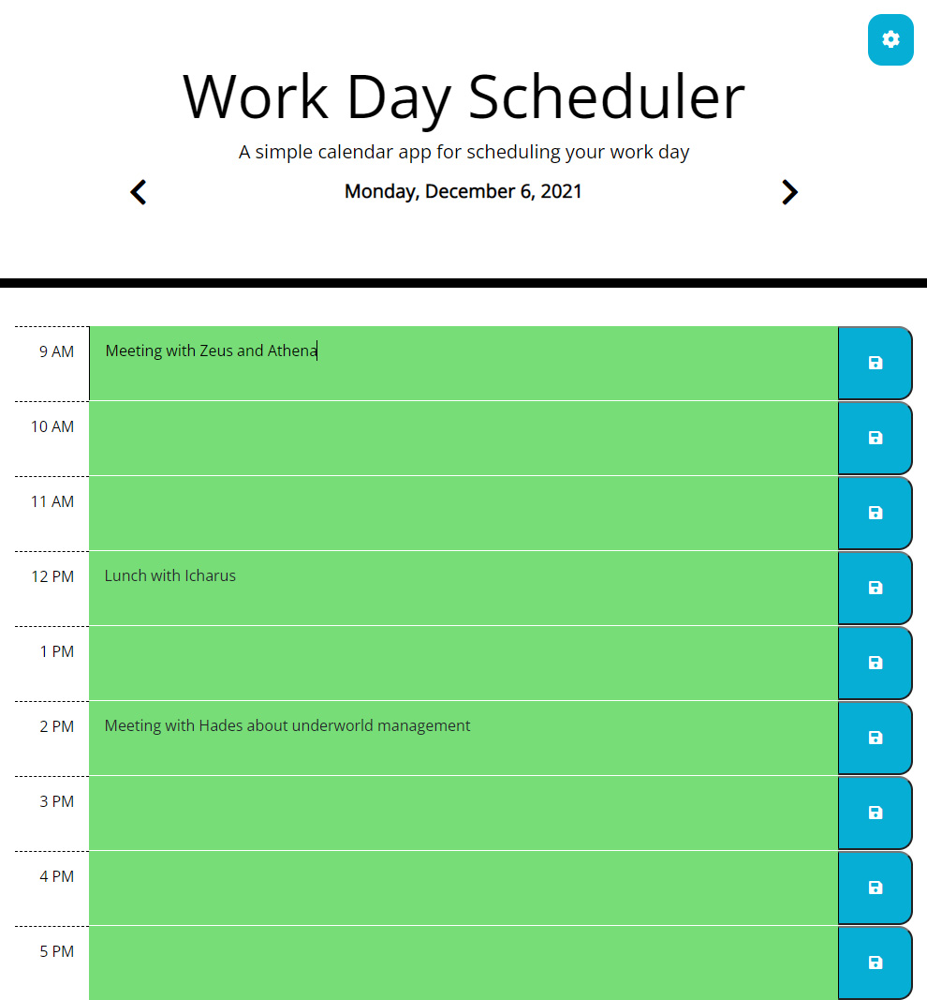

# Work Day Scheduler
This work day scheduler allows users to fill out their day by just clicking on the time slot. On load, it defaults to the current day, but nifty navigation allows users to move between days from yesterday all the way to a week in advance, so one can really plan things out. When the save button is clicked, the text is saved into the localstorage, so no worries about losing stuff upon page refresh. (However, anything saved from more than 2 days in the past is automatically discarded because this scheduler does not allow one to view that day and beyond.)\
For those who don't exactly work 9-to-5 (the default), there is a button that toggles settings that allows people to adjust viewable hours to adjust from any start time until, at latest, 11pm.\
Upon load, one may notice gray, red, and/or green. This scheduler highlights the day, with red showing the current hour (what your schedule says you should be doing right now), gray showing anything in the past (if it's supposed to have happened, it's gray), and green showing what's to come.

# View Live Page
[View the live Work Day Scheduler page on GitHub.](https://jcolecodes.github.io/timetable-dolly/)

# Screenshot
